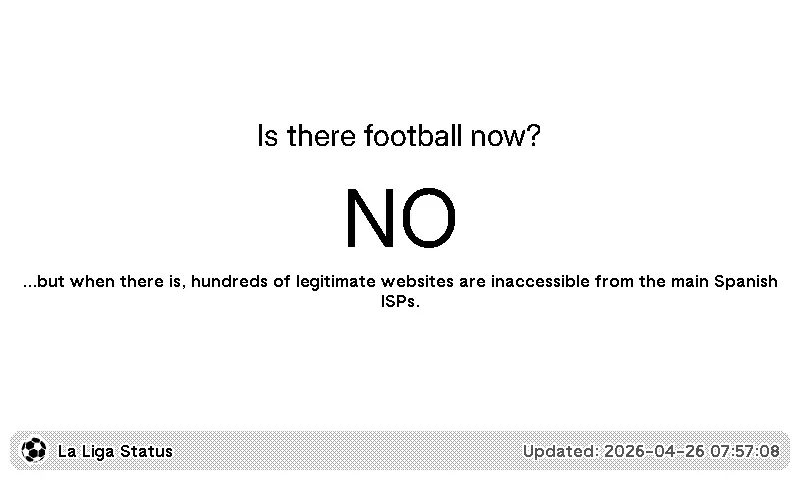
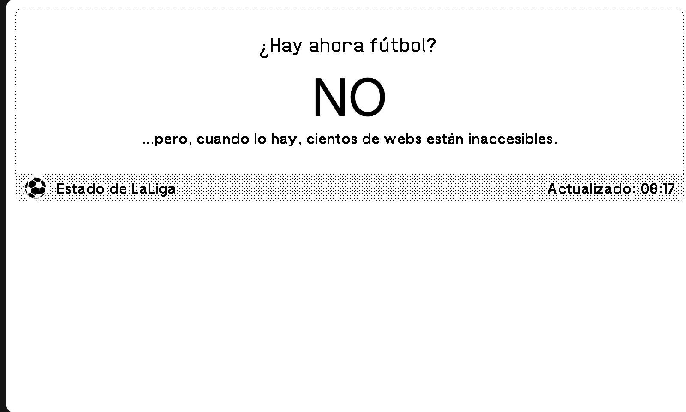
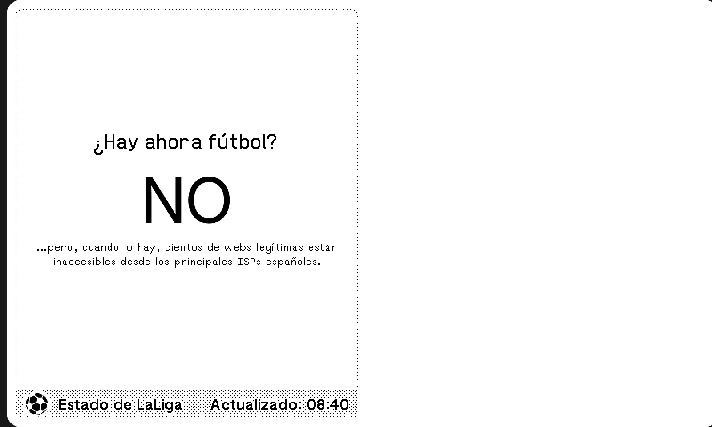
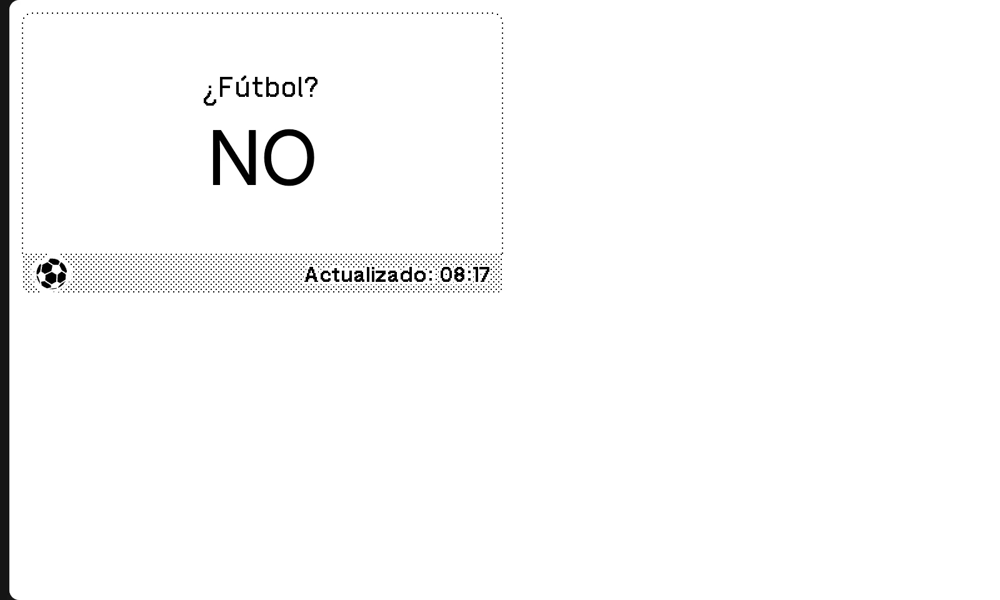

# TRMNL La Liga Plugin

A TRMNL plugin to check if La Liga is blocking internet services in Spain.

## Icon

The plugin icon is stored in the TRMNL bundle and referenced from settings.yml.

<div align="center">
	
</div>

## Previews

| Full View | Half Horizontal View |
|------------|----------------------|
|  |  |

| Half Vertical View | Quadrant View |
|-------------------|----------------|
|  |  |

## Templates

- **full.liquid**: Default view showing active blocks.
- **half_horizontal.liquid** and **half_vertical.liquid**: Compact variants of the full view.
- **quadrant.liquid**: Minimal view displaying the most critical status.

## Example of endpoint when there's soccer

```

{"Status":0,"TC":false,"RD":true,"RA":true,"AD":false,"CD":false,"Question":[{"name":"blocked.dns.hayahora.futbol.","type":1}],"Answer":[{"name":"blocked.dns.hayahora.futbol.","type":1,"TTL":17,"data":"172.67.179.37"},{"name":"blocked.dns.hayahora.futbol.","type":1,"TTL":17,"data":"13.248.132.87"},{"name":"blocked.dns.hayahora.futbol.","type":1,"TTL":17,"data":"172.67.209.15"},{"name":"blocked.dns.hayahora.futbol.","type":1,"TTL":17,"data":"172.67.149.174"},{"name":"blocked.dns.hayahora.futbol.","type":1,"TTL":17,"data":"172.66.132.196"},{"name":"blocked.dns.hayahora.futbol.","type":1,"TTL":17,"data":"172.67.72.122"},{"name":"blocked.dns.hayahora.futbol.","type":1,"TTL":17,"data":"172.67.173.84"},{"name":"blocked.dns.hayahora.futbol.","type":1,"TTL":17,"data":"104.21.80.22"},{"name":"blocked.dns.hayahora.futbol.","type":1,"TTL":17,"data":"104.18.20.111"},{"name":"blocked.dns.hayahora.futbol.","type":1,"TTL":17,"data":"104.21.16.202"},{"name":"blocked.dns.hayahora.futbol.","type":1,"TTL":17,"data":"172.67.152.159"},{"name":"blocked.dns.hayahora.futbol.","type":1,"TTL":17,"data":"104.21.89.181"},{"name":"blocked.dns.hayahora.futbol.","type":1,"TTL":17,"data":"163.181.49.183"},{"name":"blocked.dns.hayahora.futbol.","type":1,"TTL":17,"data":"172.67.169.58"},{"name":"blocked.dns.hayahora.futbol.","type":1,"TTL":17,"data":"104.21.6.132"},{"name":"blocked.dns.hayahora.futbol.","type":1,"TTL":17,"data":"104.21.58.190"},{"name":"blocked.dns.hayahora.futbol.","type":1,"TTL":17,"data":"172.67.165.116"},{"name":"blocked.dns.hayahora.futbol.","type":1,"TTL":17,"data":"163.181.49.190"},{"name":"blocked.dns.hayahora.futbol.","type":1,"TTL":17,"data":"104.21.55.229"},{"name":"blocked.dns.hayahora.futbol.","type":1,"TTL":17,"data":"104.21.88.198"},{"name":"blocked.dns.hayahora.futbol.","type":1,"TTL":17,"data":"172.67.187.195"},{"name":"blocked.dns.hayahora.futbol.","type":1,"TTL":17,"data":"104.21.67.158"},{"name":"blocked.dns.hayahora.futbol.","type":1,"TTL":17,"data":"172.67.75.137"},{"name":"blocked.dns.hayahora.futbol.","type":1,"TTL":17,"data":"104.21.46.160"},{"name":"blocked.dns.hayahora.futbol.","type":1,"TTL":17,"data":"104.21.39.229"},{"name":"blocked.dns.hayahora.futbol.","type":1,"TTL":17,"data":"172.64.66.1"},{"name":"blocked.dns.hayahora.futbol.","type":1,"TTL":17,"data":"104.21.79.74"},{"name":"blocked.dns.hayahora.futbol.","type":1,"TTL":17,"data":"172.67.161.145"},{"name":"blocked.dns.hayahora.futbol.","type":1,"TTL":17,"data":"35.71.145.101"},{"name":"blocked.dns.hayahora.futbol.","type":1,"TTL":17,"data":"104.18.21.111"},{"name":"blocked.dns.hayahora.futbol.","type":1,"TTL":17,"data":"172.66.47.81"},{"name":"blocked.dns.hayahora.futbol.","type":1,"TTL":17,"data":"104.18.54.45"},{"name":"blocked.dns.hayahora.futbol.","type":1,"TTL":17,"data":"172.67.177.243"},{"name":"blocked.dns.hayahora.futbol.","type":1,"TTL":17,"data":"104.21.58.226"},{"name":"blocked.dns.hayahora.futbol.","type":1,"TTL":17,"data":"104.21.73.217"},{"name":"blocked.dns.hayahora.futbol.","type":1,"TTL":17,"data":"172.67.178.14"},{"name":"blocked.dns.hayahora.futbol.","type":1,"TTL":17,"data":"188.114.97.3"},{"name":"blocked.dns.hayahora.futbol.","type":1,"TTL":17,"data":"172.66.44.175"},{"name":"blocked.dns.hayahora.futbol.","type":1,"TTL":17,"data":"104.21.31.183"},{"name":"blocked.dns.hayahora.futbol.","type":1,"TTL":17,"data":"104.21.57.185"},{"name":"blocked.dns.hayahora.futbol.","type":1,"TTL":17,"data":"172.67.200.254"},{"name":"blocked.dns.hayahora.futbol.","type":1,"TTL":17,"data":"104.21.57.85"},{"name":"blocked.dns.hayahora.futbol.","type":1,"TTL":17,"data":"172.67.195.106"},{"name":"blocked.dns.hayahora.futbol.","type":1,"TTL":17,"data":"163.181.49.181"},{"name":"blocked.dns.hayahora.futbol.","type":1,"TTL":17,"data":"104.21.8.163"},{"name":"blocked.dns.hayahora.futbol.","type":1,"TTL":17,"data":"104.18.50.34"},{"name":"blocked.dns.hayahora.futbol.","type":1,"TTL":17,"data":"104.20.25.8"},{"name":"blocked.dns.hayahora.futbol.","type":1,"TTL":17,"data":"172.67.149.234"},{"name":"blocked.dns.hayahora.futbol.","type":1,"TTL":17,"data":"172.67.130.142"},{"name":"blocked.dns.hayahora.futbol.","type":1,"TTL":17,"data":"104.21.21.139"},{"name":"blocked.dns.hayahora.futbol.","type":1,"TTL":17,"data":"172.67.157.227"},{"name":"blocked.dns.hayahora.futbol.","type":1,"TTL":17,"data":"104.21.31.32"},{"name":"blocked.dns.hayahora.futbol.","type":1,"TTL":17,"data":"104.21.56.110"},{"name":"blocked.dns.hayahora.futbol.","type":1,"TTL":17,"data":"104.21.74.250"},{"name":"blocked.dns.hayahora.futbol.","type":1,"TTL":17,"data":"188.114.96.3"},{"name":"blocked.dns.hayahora.futbol.","type":1,"TTL":17,"data":"75.2.97.79"},{"name":"blocked.dns.hayahora.futbol.","type":1,"TTL":17,"data":"172.67.140.111"},{"name":"blocked.dns.hayahora.futbol.","type":1,"TTL":17,"data":"104.21.3.221"},{"name":"blocked.dns.hayahora.futbol.","type":1,"TTL":17,"data":"104.21.90.150"},{"name":"blocked.dns.hayahora.futbol.","type":1,"TTL":17,"data":"172.67.184.166"},{"name":"blocked.dns.hayahora.futbol.","type":1,"TTL":17,"data":"104.21.29.93"},{"name":"blocked.dns.hayahora.futbol.","type":1,"TTL":17,"data":"172.67.174.37"},{"name":"blocked.dns.hayahora.futbol.","type":1,"TTL":17,"data":"99.83.151.71"},{"name":"blocked.dns.hayahora.futbol.","type":1,"TTL":17,"data":"172.67.148.184"},{"name":"blocked.dns.hayahora.futbol.","type":1,"TTL":17,"data":"172.67.199.25"},{"name":"blocked.dns.hayahora.futbol.","type":1,"TTL":17,"data":"172.67.190.141"},{"name":"blocked.dns.hayahora.futbol.","type":1,"TTL":17,"data":"104.21.90.139"},{"name":"blocked.dns.hayahora.futbol.","type":1,"TTL":17,"data":"172.67.215.231"},{"name":"blocked.dns.hayahora.futbol.","type":1,"TTL":17,"data":"172.67.188.25"},{"name":"blocked.dns.hayahora.futbol.","type":1,"TTL":17,"data":"104.21.7.242"},{"name":"blocked.dns.hayahora.futbol.","type":1,"TTL":17,"data":"104.21.56.202"},{"name":"blocked.dns.hayahora.futbol.","type":1,"TTL":17,"data":"172.67.73.44"},{"name":"blocked.dns.hayahora.futbol.","type":1,"TTL":17,"data":"172.67.72.64"},{"name":"blocked.dns.hayahora.futbol.","type":1,"TTL":17,"data":"172.67.206.68"},{"name":"blocked.dns.hayahora.futbol.","type":1,"TTL":17,"data":"172.67.174.233"},{"name":"blocked.dns.hayahora.futbol.","type":1,"TTL":17,"data":"172.67.187.219"},{"name":"blocked.dns.hayahora.futbol.","type":1,"TTL":17,"data":"104.21.68.61"},{"name":"blocked.dns.hayahora.futbol.","type":1,"TTL":17,"data":"172.67.154.221"},{"name":"blocked.dns.hayahora.futbol.","type":1,"TTL":17,"data":"104.21.92.157"},{"name":"blocked.dns.hayahora.futbol.","type":1,"TTL":17,"data":"172.67.209.158"},{"name":"blocked.dns.hayahora.futbol.","type":1,"TTL":17,"data":"104.21.35.171"},{"name":"blocked.dns.hayahora.futbol.","type":1,"TTL":17,"data":"172.66.140.62"},{"name":"blocked.dns.hayahora.futbol.","type":1,"TTL":17,"data":"172.67.153.158"}],"Comment":"Response from 172.64.53.21."}

```

## Example of endpoint where there's no soccer

```

{"Status":3,"TC":false,"RD":true,"RA":true,"AD":false,"CD":false,"Question":[{"name":"blocked.dns.hayahora.futbol.","type":1}],"Authority":[{"name":"dns.hayahora.futbol.","type":6,"TTL":1800,"data":"ns1.digitalocean.com. hostmaster.dns.hayahora.futbol. 0 10800 3600 604800 1800"}],"Comment":"Response from 172.64.52.210."}

```
